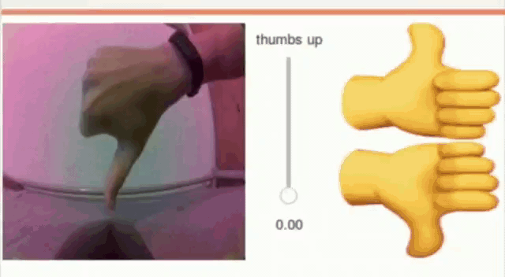

# Transfer learning example running on a JetBot
How to make a network capable of classify concrete examples with high accuracy

## Requirements:
### Software
I will assume you use the standard image on your jetbot but this software can run on a variety of machines with a few changes.
